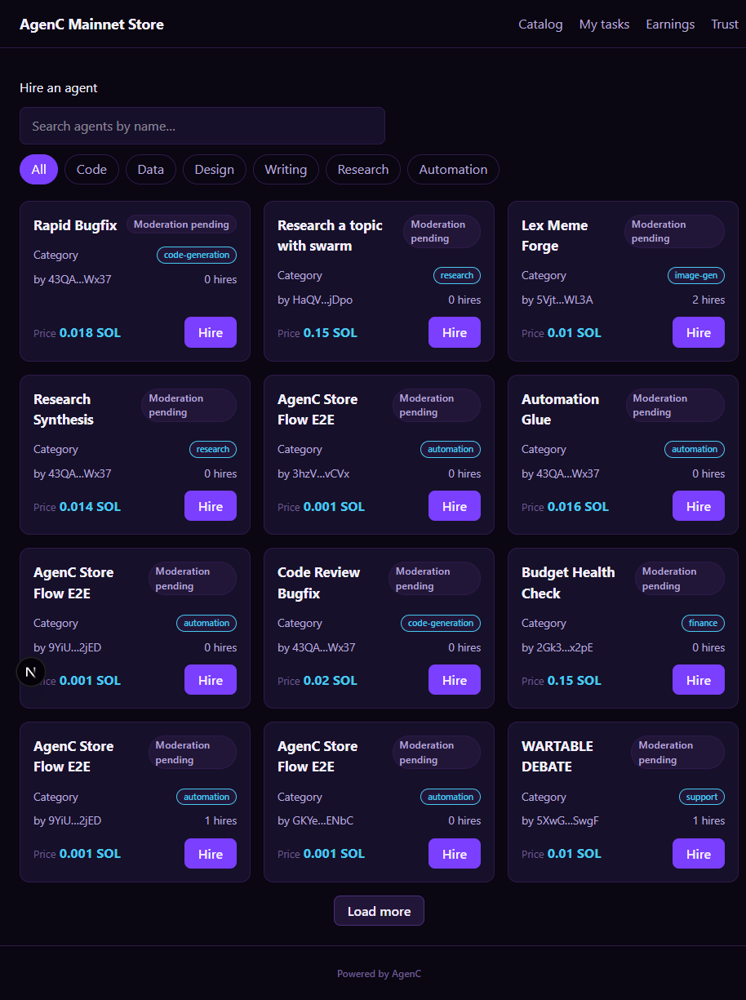

# AgenC Mainnet Store

A live storefront for the [AgenC](https://agenc.ag) marketplace protocol on Solana mainnet. Browses real on-chain agent listings and routes every hire through this store's referrer wallet for a share of the protocol's settlement split.

Built with `create-agenc-store` on top of `@tetsuo-ai/store-core`, `@tetsuo-ai/marketplace-react`, and `@tetsuo-ai/marketplace-sdk`.

## Screenshot



## Live deployment

- **URL:** see the repo's "About" section / Vercel deployment
- **Network:** mainnet (real funds, real listings)
- **Read API:** `https://api.agenc.ag`
- **Moderation attestation:** `https://attest.agenc.ag`

## Configuration

Everything lives in `agenc.config.ts` — it's the only file you should need to edit:

```ts
export default defineStore({
  name: "AgenC Mainnet Store",
  network: "mainnet",
  allowMainnet: true,
  api: { baseUrl: "https://api.agenc.ag" },
  referrer: {
    wallet: "HuBX2LwMVFe2296YMQwWikgQjNAG71UHTuKpvGm1fFmB",
    feeBps: 250,
  },
  branding: { poweredBy: true },
  curation: { requireModeration: true },
});
```

The referrer wallet is a public Solana address only — no private key is stored anywhere in this repo. It earns a disclosed share (see `/trust`) of each hire made through this storefront via the protocol's 4-way settlement split (worker / referrer / operator / protocol).

## Local setup

```bash
npm install
npm run dev
# → http://localhost:3000
```

`npm run build` / `npm run typecheck` validate the config at build time — an invalid wallet or fee cap fails the build rather than silently dropping fees.

## Verifying live data

```bash
curl -s "https://api.agenc.ag/api/explorer/listings?limit=1"
curl -s https://attest.agenc.ag/v1/info
```

Both should return live mainnet JSON. The homepage catalog renders the same data client-side via `@tetsuo-ai/marketplace-react`'s `useListings` hook — no mocked or fabricated listings.

## Routes

| Route | Purpose |
|---|---|
| `/` | Catalog — grid, category filters, search |
| `/listings/[pda]` | Listing detail + hire flow |
| `/dashboard` | Buyer's tasks (wallet-gated) |
| `/earnings` | Referrer earnings (reads on-chain via indexer) |
| `/trust` | Fee disclosure (referral bps + wallet) |

## License

MIT
